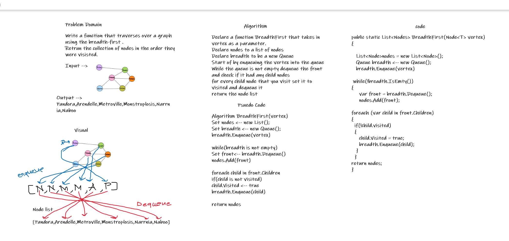

# Challenge Summary
<!-- Short summary or background information -->
Return nodes of a graph using the breadth-first traversal

## Challenge Description
<!-- Description of the challenge -->
Extend your graph object with a breadth-first traversal method that accepts a starting node return a collection of nodes in the order they were visited.
## Approach & Efficiency
<!-- What approach did you take? Why? What is the Big O space/time for this approach? -->
- Time --> O(n)
- Space --> O(n)

## Solution
<!-- Embedded whiteboard image -->
