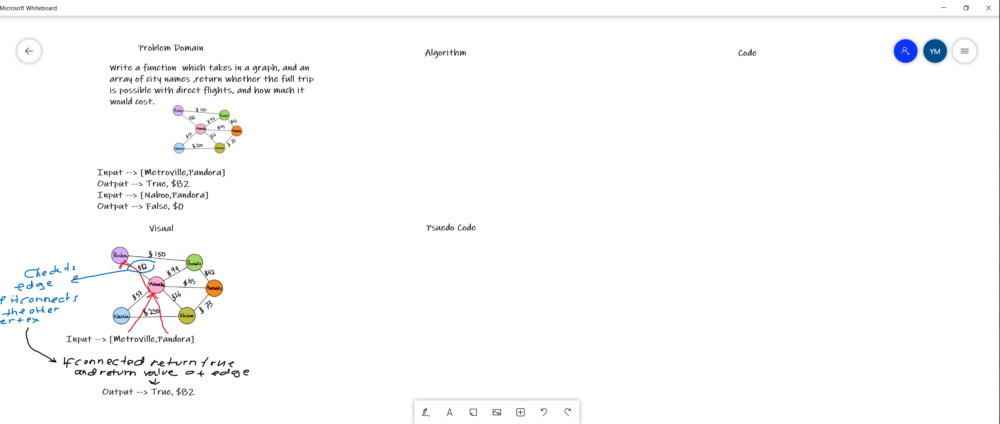

# Challenge Summary
<!-- Short summary or background information -->
Return a boolean and a amount depending on which flight you are taking.

## Challenge Description
<!-- Description of the challenge -->
Write a function  which takes in a graph, and an array of city names ,return whether the full trip is possible with direct flights, and how much it would cost.
## Approach & Efficiency
<!-- What approach did you take? Why? What is the Big O space/time for this approach? -->
- Time --> O(v)
- Space --> O(n)

## Solution
<!-- Embedded whiteboard image -->
