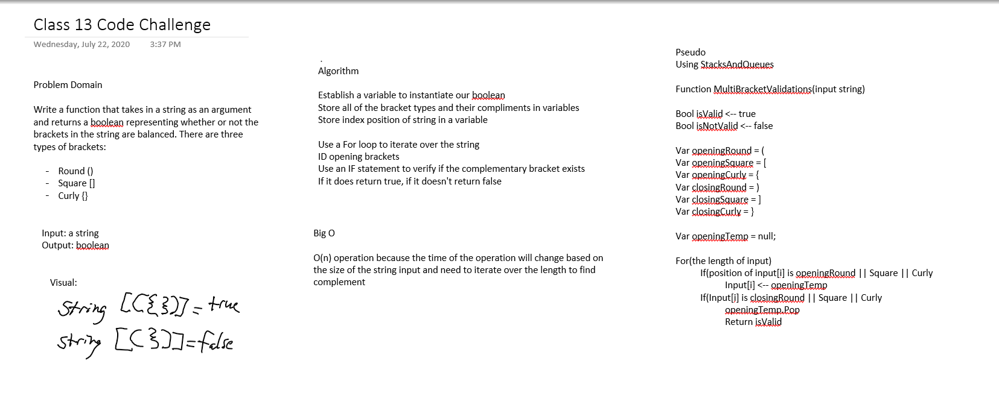

# Challenge Summary
<!-- Short summary or background information -->
Taking a string as an argument, return a boolean representing whether or not the brackets in the string are balanced. There are three types of brackets:

- Round Brackets: ()
- Square Brackets: []
- Curly Brackets: {}
## Challenge Description
<!-- Description of the challenge -->
- Input, "{}", will evaluate as TRUE
- Input, "{}(){}", will evaluate as TRUE
- Input, "()[[Extra Characters]]", will evaluate as TRUE
- Input, "(){}[[]]", will evaluate as TRUE
- Input, "{}{Code}(Fellows)(())", will evaluate as TRUE
- Input, "[({}]", will evaluate as FALSE
- Input, "(](", will evaluate as FALSE
- Input, "{(})", will evaluate as FALSE
## Approach & Efficiency
<!-- What approach did you take? Why? What is the Big O space/time for this approach? -->
### Big O

| Time | Space |
| :----------- | :----------- |
| O(n) | O(n) |

## Solution
<!-- Embedded whiteboard image -->
